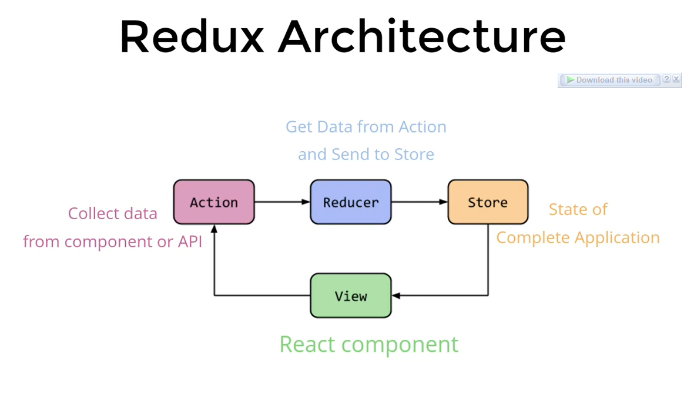

# Complete REDUX Notes :-




# Code to Check Installation Status :-

```js
npm version

node

npx create-react-app appName    // Create Project // ✨✨

cd appName

npm start

npm i redux     // ✨✨

npm i react-redux   // ✨✨

```


# 1. Action : 🎯
```js
What is action ?
Make function in action file ?
Return data and type ?
Add Constant and use constant in action ?


                      data      
React Component  --------------> Store
              
```


# Redux Tutorial : 👇 ✨ ✨ ***(Source : TechGun)***

Q. Normally in React how to pass data ?

Ans. The data in React always flows from parent to child components which makes it unidirectional.

🔴 Disadvantage of prop drilling :-

Parent Data is passed one by one to child in downward direction.

This can also be done by React Hooks (Context API, useContext). ✨

Pre-requistie :
#21 Prop drilling
#_ useReducer

---

🟢 How Redux solve this problem ?

Data is stored in Redux Store which can be directly given to any branch component which is present anywhere.

```cs
What is Redux ?

Redux is a pattern and library for managing and updating application state using events called "actions". It serves as a centralized store for state that needs to be used across your entire application, with rules ensuring that the state can only be updated in a predictable fashion.

Redux Main Topics :

1. Action : What to do ?
2. Reducer : How to do ?
3. Store : Object which holds the state of the application.
4. Functions associated with store: 
    - createStore()
    - dispatch(action)
    - getState()
```
```js
// 1. Action : 🎯

// Action are Plain javascript objects that have a type field.
// 🟢 Action only tell what to do,
// But they don't tell how to do

// Example of Action

return {
  type: 'INCREMENT',
  payload: num
}

// 1.1. Action Creator
// Pure function which creates an action
// 🟢 It is reusable, Portable, and Easy to Test
    export const incNumber = (num) => {

      return {
        type: 'INCREMENT',
        payload: num
      }
    }
```
```js
// 2. Reducer
// Reducer are the functions that take the current state and an action as arguments, and return a new state result.

const initialState = 0;

const changeTheNumber = (state = initialState, action) => {
  switch(action.type) {
    case "INCREMENT" : return state + action.payload;
    case "DECREMENT" : return state -1;
    default : return state;
  }
}
```

```js
3. Store
// The Redux Store brings together the state, actions, and reducers that make up your app.

🟢 It is important to note that you will only have a single store in Redux application.

🟢 Every Redux store has a single root reducer function.

import {createStoe} from "redux";
const store = createStore(rootReducers);
```

```css
Redux Principle :- 

1. Single Source of Truth

The global state of your application is stored as an object inside a single store.

2. State is Read Only

The only way to change the state is to dispatch an action

3. Immutability, one way data flow, Predictability of outcome.

4. Changes are made with Pure Reducer function.
```

```js
Redux Life Cycle 🚴‍♂️

Action Creator -> Action       -> dispatch     -> Reducers        -> Store
You            -> Booking Form -> Submit Form  -> Ticket Counters -> Railway Central

```

# Toggle active button state using javascript in React

```js
  const pageChanger = (i) => {
    let arr = [0, 0, 0];
    arr[i] = 1;
    setIconToggler(arr)
  }
```
```js
      <div className=" max-w-[700px] mx-auto px-1 bg-white shadow-inner flex flex-row right-7 left-7 justify-between fixed inset-x-0 bottom-0 p-4 border-t-4 rounded-md">
        <Link to="/LoginAsWaiter/NewOrder">
           pageChanger(0)} style={{"opacity":`${iconToggler[0] ? `1` : `0.3`}`, "filter": `${iconToggler[0] ? `brightness(0) saturate(100%) invert(23%) sepia(46%) saturate(4185%) hue-rotate(204deg) brightness(100%) contrast(89%)` : ``}`}}/>
        </Link>
         pageChanger(1)} style={{"opacity":`${iconToggler[1] ? `1` : `0.3`}`, "filter": `${iconToggler[1] ? `brightness(0) saturate(100%) invert(23%) sepia(46%) saturate(4185%) hue-rotate(204deg) brightness(100%) contrast(89%)` : ``}`}} />
        <Link to="/LoginAsWaiter/NewOrder/ActiveOrder">
           pageChanger(2)} style={{"opacity":`${iconToggler[2] ? `1` : `0.3`}`, "filter": `${iconToggler[2] ? `brightness(0) saturate(100%) invert(23%) sepia(46%) saturate(4185%) hue-rotate(204deg) brightness(100%) contrast(89%)` : ``}`}} />
        </Link>
      </div>
```

# # Redux Tutorial (Source : Code Step by Step)

